# DCGAN for MNIST

This is an implementation of the paper ['Unsupervised Representation Learning with Deep Convolutional Generative Adversarial Networks' by Radford, et al](https://arxiv.org/pdf/1511.06434.pdf) on the MNIST dataset of hand-written digits.

## Background

[Generative Adversarial Networks (GANs)](https://papers.nips.cc/paper/5423-generative-adversarial-nets.pdf) are a very interesting class of generative models that were introduced by Ian Goodfellow in 2014. The promise of GANs was that they could be given a set of unlabeled data, and be trained to generate new samples similar to that data. For example, feed the model a large set of images of cats, and it would learn to create new, original images of cats that it had never seen before. 

This is exciting for several reasons. On a practical level, there is far more unlabeled data in the world than there is labeled data. For researchers, it is exciting because it is an example of unsupervised learning. Learning useful representations of unlabeled data has many applications, and as Richard Feynman famously said, "What I cannot create, I do not understand". 

However, early GANs proved to be very difficult to train, especially with complex data like images. In an effort to overcome this, the authors of this paper introduced DCGAN, a GAN specialized for images. From extensive model exploration, they found a set of architectures that work well for image generation.

## How do DCGANs work?

A DCGAN pits two models against each other - a 'Generator' (G), that takes a random code and outputs a generated image, and a 'Discriminator' (D), that attempts to distinguish the real training images from the generated ones. 

Let's define some terms:

x(i) = real training example

z(i) = randomly generated code

G(z(i)) = output of G, an image generated from z(i)

D(x(i)) = output of D when fed the real training example, the probability it gives the real example of being real. D wants this to be as high as possible. 

D(G(z(i))) = output of D when fed the generated example, the probability it gives the fake example of being real. D wants this to be as low as possible, while G wants it to be as high as possible.

## The Cost Function

Loss(D) = -(1/m) ∑ [ log D(x(i)) + log (1 - D(G(z(i))))]

Loss(G) = (1/m) ∑ log(1 - D(G(z(i))))


## Architectures for Generating Images

The authors found the following architecture changes to be important for successful training:

* All-convolutional nets, with no spatial pooling functions such as maxpool.
* They eliminated the fully connected layers often placed on top of convolutional layers. Only the input and output layers are not convolutional.
* Batch normalization at every layer except the generator output and the discriminator input layers.
* ReLU activation for all layers in the generator except the output layer, which uses tanh. This necessitates a pre-processing step to scale the training images to [-1, 1], the range of tanh, so that the range of outputs from G will match the real examples.
* LeakyReLU activation in the discriminator for all layers, with a leak-slope of 0.2.
* They used the Adam optimizer, with the momentum parameter B1 set to 0.5, and a learning rate of 0.0002. 

This implementation uses all of the above, with the exception that it uses LeakyReLU in the generator, and no fully connected layers at all.

## Results

The generator started producing convincing samples after about 8 epochs. 

Generated digits:

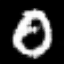 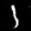  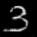  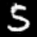    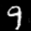
  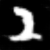  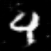 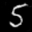   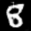 
 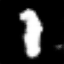    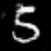 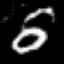 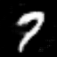 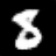 


## Trained Model

You can download the trained model [here](https://storage.googleapis.com/gan-training-207705-public-bucket/MNIST-DCGAN-model-1.zip).

To pull generated samples from this model:
1. Unzip the model, and drag it into the project directory
2. cd into the project directory
3. Run ```python -m trainer.task --sample [NUMBER_OF_SAMPLES_TO_OUTPUT]```
4. You can find the resulting images in the trainer/samples folder. 

If you want to store the trained model somewhere else, just include ```--checkpoint-dir [YOUR_PATH]``` in the command.

If you want to output the samples to another location, just include ```--sample-dir [YOUR_PATH]``` in the command.

## Next Steps

The first few architectures I tried for this project had all of the DCGAN recommendations, but were much smaller, and suffered from mode collapse pretty quickly out of the gate. Mode collapse occurs when the generator starts outputting only one image over and over, and is one of the most common ways for GANs to fail. 

This architecture is the first one I tried that did work, and I'm going to leave it at this for now. However, I suspect that this architecture may be a bit bigger than it needs to be. All else being equal, a simpler model that can achieve the same results is always preferable. If I come back to this project in the future, I want to try going down to four layers instead of five, and try other techniques to stabilize it if there are issues.

## Acknowledgements

The architecture that actually ended up working was based on this [excellent comparison of GANs and DCGANs](https://github.com/znxlwm/tensorflow-MNIST-GAN-DCGAN/) by Hyeonwoo Kang. 


